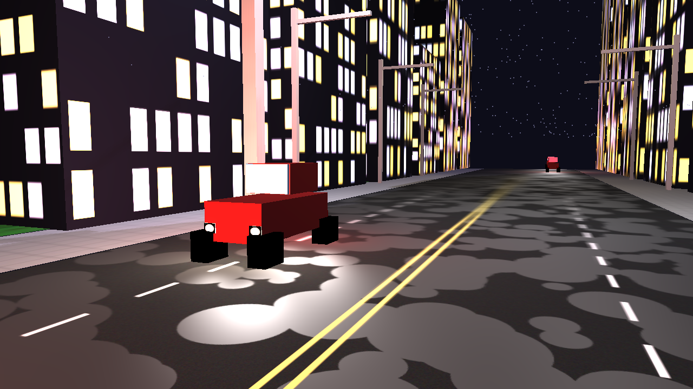
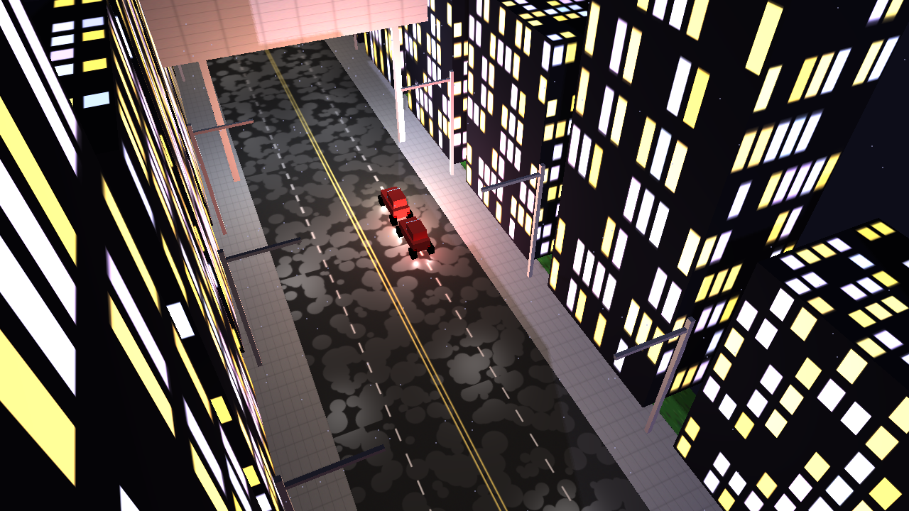
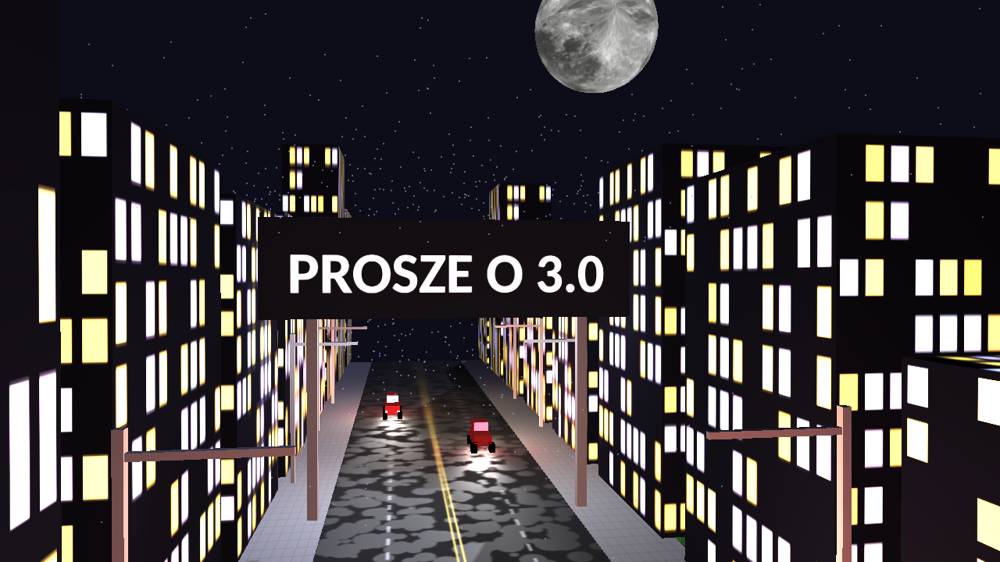

# Night City 

Render w czasie rzeczywistym 3D zbudowany w Pythonie, który generuje futurystyczną, oświetloną scenę "Night City".

## Autor

**Maciej Leśniak**

## Zrzuty ekranu

Poniżej znajdują się przykładowe zrzuty ekranu z działającego renderera.



---



---



---

## Funkcje

*   **Kamera pierwszoosobowa:** Lataj po scenie za pomocą klasycznej kamery w stylu FPS.
*   **Generowanie proceduralne:** Budynki są generowane algorytmicznie, co za każdym razem tworzy unikalny układ miasta.
*   **Dynamiczne oświetlenie:** Scena jest oświetlona latarniami ulicznymi i emisyjnymi teksturami.
*   **Mapowanie cieni:** Cienie rzucane są przez obiekty w czasie rzeczywistym.
*   **Efekty atmosferyczne:** Symulacja deszczu i księżyc na niebie wzmacniają nastrój.
*   **Teksturowane modele:** Wszystkie obiekty w scenie, od drogi po billboard, są oteksturowane.

## Użyte technologie

*   **Python 3:** Główny język projektu.
*   **PyOpenGL:** Biblioteka do programowania grafiki w OpenGL w Pythonie.
*   **GLFW:** Biblioteka do tworzenia okien, kontekstów i zarządzania danymi wejściowymi.
*   **PyGLM:** Biblioteka matematyczna do programowania grafiki.
*   **NumPy:** Używana do operacji numerycznych, zwłaszcza do obsługi danych wierzchołków.
*   **Pillow (PIL):** Używana do ładowania i manipulowania teksturami obrazów.

## Pierwsze kroki

Postępuj zgodnie z poniższymi krokami, aby skonfigurować i uruchomić projekt na swoim komputerze.

### 1. Wymagania wstępne

Upewnij się, że masz zainstalowanego **Pythona 3** na swoim systemie.

### 2. Instalacja i konfiguracja

Zaleca się użycie wirtualnego środowiska do zarządzania zależnościami.

```bash
# 1. Utwórz i aktywuj wirtualne środowisko
python3 -m venv .venv
source .venv/bin/activate

# 2. Zainstaluj wymagane pakiety
pip install -r requirements.txt 

# 3. Uruchamianie aplikacji

python3 main.py
```

## Sterowanie

*   **WASD:** Poruszanie kamerą do przodu, do tyłu, w lewo i w prawo.
*   **Mysz:** Rozglądanie się po scenie.
*   **P:** Zrobienie zrzutu ekranu. Obraz zostanie zapisany jako plik PNG w głównym katalogu projektu.
*   **ESC:** Zamknięcie aplikacji.

## Struktura projektu

Projekt jest zorganizowany w kilka modułów w celu rozdzielenia odpowiedzialności:

*   `main.py`: Główny punkt wejścia. Inicjalizuje silnik i uruchamia główną pętlę.
*   `scene.py`: Zarządza wszystkimi obiektami, światłami i shaderami w scenie 3D.
*   `camera.py`: Implementuje kamerę pierwszoosobową.
*   `mesh.py`: Definiuje geometrię obiektów 3D (sześciany, płaszczyzny itp.).
*   `shader.py`: Wrapper do ładowania i kompilowania shaderów GLSL.
*   `texture.py`: Obsługuje ładowanie i bindowanie tekstur obrazów.
*   `generate_assets.py`: Skrypt narzędziowy do proceduralnego generowania tekstur.
*   `shaders/`: Katalog zawierający pliki shaderów wierzchołków i fragmentów GLSL.
*   `textures/`: Katalog na obrazy tekstur generowane przez `generate_assets.py`.
